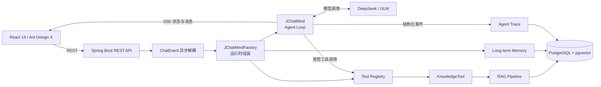
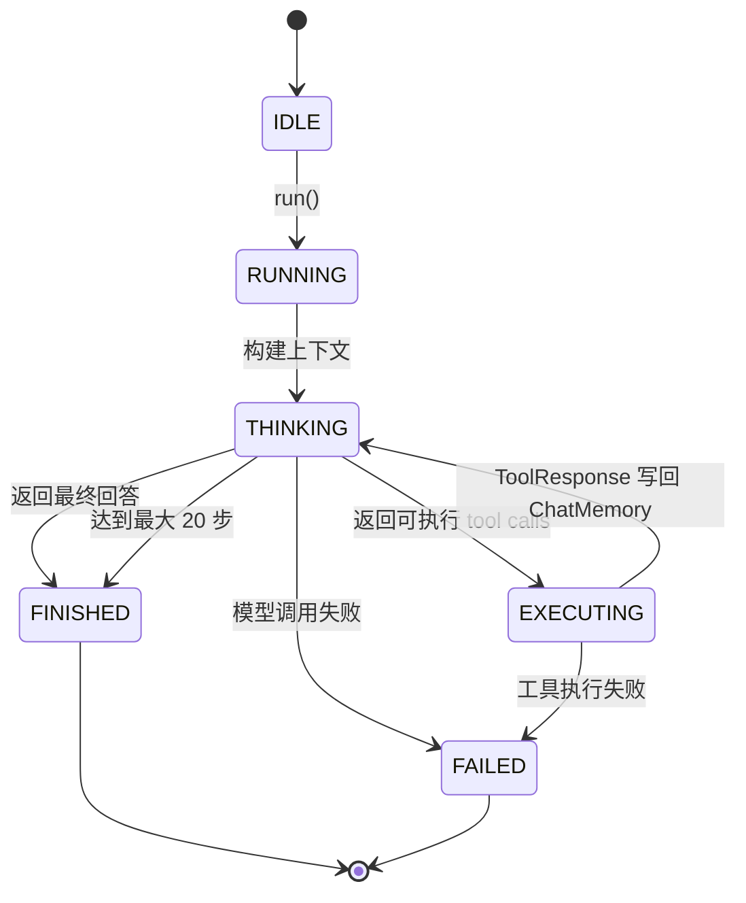
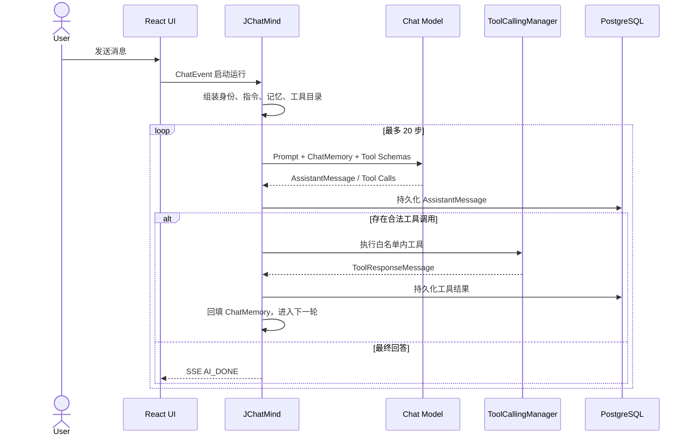
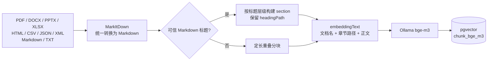
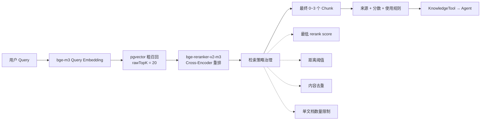
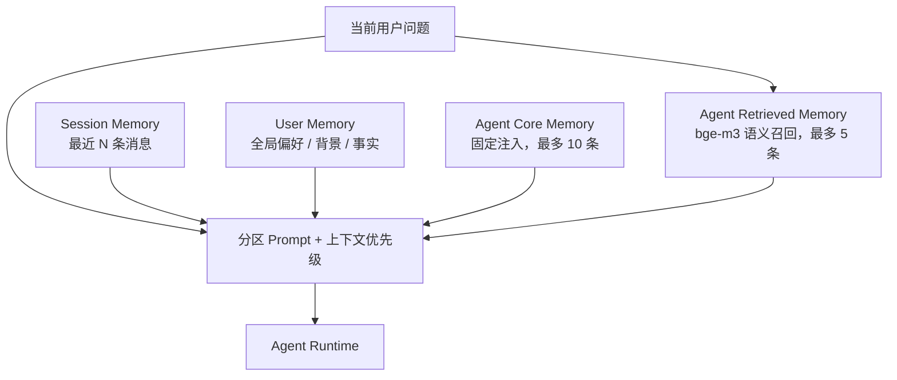
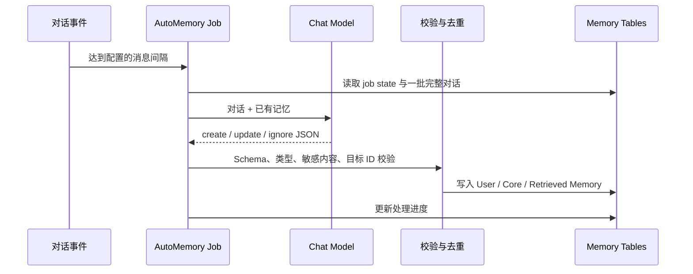
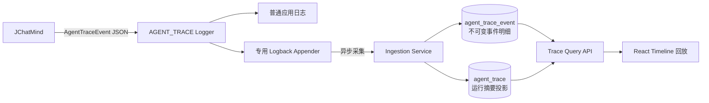

# JChatMind

> 一个可配置、可记忆、可观测，并通过离线评测持续优化检索质量的 AI Agent 系统。

JChatMind 基于 Spring AI 自主实现 Agent Runtime：模型在 **Think → Tool Execute → Observe** 循环中完成多步推理，按 Agent 配置调用工具与知识库；系统同时提供多格式文档 RAG、跨会话长期记忆、全链路 Agent Trace，以及通过 SSE 驱动的 React 对话界面。

## 本地联网搜索

联网搜索使用 Docker 中的 SearXNG 和 `mcp-searxng` HTTP 服务，不需要第三方搜索 API Key，也不依赖本机 Node.js 或 npx。

```bash
docker compose -f docker-compose.search.yml up -d

cd jchatmind
./mvnw spring-boot:run
```

SearXNG 默认监听 `http://localhost:8081`，MCP Streamable HTTP 服务监听 `http://localhost:3000/mcp`。远程部署时可通过 `WEB_SEARCH_MCP_URL` 覆盖 MCP 服务地址。
联网搜索默认启用；如需临时关闭，可设置 `WEB_SEARCH_MCP_ENABLED=false`。

停止服务：

```bash
docker compose -f docker-compose.search.yml down
```

## 核心亮点

| 能力 | 实现摘要 |
| --- | --- |
| **自主 Agent Runtime** | 关闭 Spring AI 内部工具自动执行，自主接管模型决策、工具白名单校验、执行结果回填、状态迁移与终止条件 |
| **实验驱动的 RAG** | `bge-m3` 粗召回 + `bge-reranker-v2-m3` Cross-Encoder 重排；保留数据集、逐题结果、评测脚本与指标报告 |
| **分层长期记忆** | User Memory、Agent Core Memory、语义召回的 Retrieved Memory；支持模型异步提取、去重、更新与幂等进度管理 |
| **Agent Trace** | 将一次运行拆解为有序事件流，记录模型调用、工具执行、步骤耗时、错误与完整性，并提供可视化时间线回放 |
| **知识与工具治理** | 每个 Agent 独立绑定模型、系统提示词、工具和知识库；运行时校验工具及知识库访问范围 |
| **端到端产品闭环** | Agent / 会话 / 知识库 / 记忆管理、SSE 实时状态、Markdown 回答渲染与 Trace 查询界面 |

## 系统架构



一次用户消息并不是简单的“请求一次模型”。HTTP 层持久化消息并发布事件，Factory 根据数据库配置恢复会话、记忆、工具和知识库，再创建一次隔离的 Agent Runtime；执行过程通过 SSE 面向用户实时反馈，同时通过 Trace 面向开发者完整留痕。

---

## 1. 自主可控的 Agent Runtime

核心运行时位于 `JChatMind`。系统将 Spring AI 的 `internalToolExecutionEnabled` 关闭，由自己的状态机控制整个工具调用闭环，因此可以在模型和工具之间加入权限、持久化、观测和失败处理逻辑。



### 一次 Agent 调用的内部链路



工程实现不止覆盖 happy path：

- 每个 Agent 只获得配置允许的可选工具，固定工具由系统统一注入。
- `KnowledgeTool` 在运行时绑定允许访问的知识库 ID，拒绝越权或伪造的 UUID。
- Assistant / Tool 消息均持久化，重启后可恢复最近窗口；恢复时过滤孤立的 Tool Response。
- 兼容模型将工具调用输出为 DSML 文本的情况，并在用户可见内容中清理协议原文。
- 模型空响应会自动重试一次；仍为空时返回可理解的兜底消息。
- 每轮向前端推送“思考中 / 工具执行中 / 完成”等 SSE 状态，而非让用户等待黑盒请求。

---

## 2. 实验驱动的 RAG 系统

JChatMind 的 RAG 不是只有“向量库 + TopK”。它覆盖文档导入、结构化分块、两阶段检索、结果治理、可观测输出和离线评测，并用实验结果决定线上策略。

### 文档索引链路



原生 Markdown 会保留标题层级和表格结构；转换类文档不盲信自动生成的标题，采用定长重叠分块。默认参数为 `maxChars=1200`、`overlapChars=150`、`minChars=80`，Embedding 文本额外加入文档名与完整章节路径，减少脱离上下文的片段歧义。

### 在线检索链路



Reranker 是当前链路的必需服务：服务不可用、超时或响应非法时直接暴露错误，不静默切换到另一套排序逻辑。最终结果允许少于 `finalTopK`，避免为了凑数把低相关内容注入 Prompt。

### 可复现的 RAG 对比实验

仓库保留评测数据集、逐题结果、汇总 JSON、报告和运行脚本。两个问题集揭示了一个重要结论：**Reranker 的选择与查询分布有关，不能只凭单一 Benchmark 决策。**

#### 更接近真实表达的自然问题集

测试规模：456 个 chunk、272 条自然问法；比较 Vector、轻量 Hybrid 与 BGE Cross-Encoder，均采用 `rawTopK=20 → finalTopK=3`。

| 指标 | Vector | Hybrid | BGE Reranker | BGE 相对 Hybrid |
| --- | ---: | ---: | ---: | ---: |
| HitRate@1 | 55.51% | 51.47% | **61.03%** | **+9.56 pct** |
| Recall@3 | 76.84% | 74.63% | **80.88%** | **+6.25 pct** |
| MRR | 65.13% | 61.83% | **70.47%** | **+8.64 pct** |

BGE 对改写、概念和比较类问题整体更有优势，因此当前在线链路使用 `bge-reranker-v2-m3`。

#### 原文线索型问题集

测试规模：177 个 chunk、220 条问题。包含关键词线索时，手工 Hybrid 在该数据分布上更强：

| 指标 | Vector | Hybrid | BGE Reranker |
| --- | ---: | ---: | ---: |
| HitRate@1 | 46.82% | **86.82%** | 79.55% |
| Recall@3 | 70.00% | **93.18%** | 90.00% |
| MRR | 56.97% | **89.85%** | 84.24% |

这个反例促使项目补充更贴近真实用户表达的数据集，而不是在第一轮实验后草率替换方案。完整报告见 [自然问题评测](./docs/rag/evaluation/easy-langent-natural/easy-langent-natural-final-report.md) 与 [BGE 对比评测](./docs/rag/evaluation/bge-reranker-comparison/mysql-bge-reranker-report.md)。

#### 阈值实验


在自然问题集的 rawTop20 候选上，BGE 分数区分正负样本的 AUC 为 **0.9097**。选择默认阈值 `minRerankScore=1.0` 后：

- 保留 89.31% 的正样本，过滤 75.84% 的负样本；
- 平均注入 chunk 从 3.00 降至 2.63；
- Recall@3 从 80.88% 降至 78.31%，以 2.57 个百分点换取更少的 Prompt 噪声。

该数据集没有域外问题，因此该阈值只用于过滤候选 chunk，不能被解读为已经解决 no-answer 判断。分析边界与复现方法见 [阈值分析报告](./docs/rag/evaluation/easy-langent-natural/easy-langent-score-threshold-analysis.md)。

---

## 3. 分层长期记忆

系统将“最近对话”和“长期记忆”明确分开，并进一步区分用户画像、Agent 核心上下文与按问题召回的 Agent 记忆。



| 记忆层 | 作用域 | 使用方式 | 设计目的 |
| --- | --- | --- | --- |
| Session Memory | 当前会话 | 最近消息窗口 | 保持短期对话连贯 |
| User Memory | 全局用户 | 选取启用且高优先级的记忆 | 理解用户偏好和背景，但禁止覆盖 Agent 身份 |
| Agent Core Memory | 单个 Agent | 每次固定注入 | 保存身份延续、长期任务和关键事实 |
| Agent Retrieved Memory | 单个 Agent | 对最新问题做 pgvector 语义召回 | 扩展容量，只注入本轮相关记忆 |

Prompt 中显式声明上下文优先级：**Agent 身份与系统指令 > 当前消息与会话 > Agent 长期记忆 > User Memory**。不同类型记忆使用独立区块和约束，降低用户画像污染 Agent 身份的风险。

### 自动记忆整理

启用自动记忆后，系统按用户消息数量触发异步任务，而不是阻塞当前回答。



- `agent_memory_job_state` 记录每个 Agent × Session 的处理进度，支持重试并避免重复消费。
- 模型只允许返回 `create / update / ignore`，写入前执行字段、作用域、目标 ID、敏感内容和精确重复校验。
- Retrieved Memory 在创建或更新时生成向量；召回失败会降级为空，不影响主对话。
- 自动记忆只处理已经获得 Assistant 回复的完整对话批次，避免从半轮对话提取错误结论。

---

## 4. 可回放的 Agent Trace

普通日志很难回答“模型第几步为什么调用了这个工具”。JChatMind 将每次运行建模为一条 Trace，并将行为拆成带序号的结构化事件。



事件覆盖完整生命周期：

```text
RUN_STARTED → CONTEXT_BUILT
  → STEP_STARTED
    → MODEL_CALL_STARTED → MODEL_CALL_COMPLETED / FAILED
    → TOOL_CALL_STARTED  → TOOL_CALL_COMPLETED / FAILED
  → STEP_COMPLETED
→ RUN_COMPLETED / RUN_FAILED
```

每个事件包含 `traceId`、单调递增 `sequenceNo`、`stepNo`、状态、时间、耗时、Payload、Error 与 Metadata。采集层使用 `(trace_id, sequence_no)` 保证幂等，并通过首尾序号与已接收事件数标记 `traceIncomplete`；大字段会被截断并记录原始大小，防止 Trace 反过来拖垮系统。

前端可通过 Trace ID 查看：运行状态、模型、总耗时、步骤数、模型/工具调用次数，以及每个事件的 Payload、错误和耗时。这让多步 Agent 的调试从“翻日志猜原因”变成按时间线定位问题。

---

## 5. 产品能力

- 创建和配置多个 Agent：名称、系统提示词、模型参数、消息窗口、工具与知识库。
- 管理多轮会话，实时展示模型思考、工具执行和最终回答。
- 创建知识库并上传 Markdown、TXT、PDF、DOCX、PPTX、XLSX、HTML、CSV、JSON、XML。
- 管理 User Memory 与 Agent Memory，支持手动维护和后台自动整理。
- 通过 Agent Trace 页面回放一次运行的完整行为时间线。
- 支持 DeepSeek 与智谱 GLM，并可通过 `ChatClientRegistry` 扩展新的模型提供商。

## 技术栈

| 层次 | 技术 |
| --- | --- |
| 后端 | Java 17、Spring Boot 3.5.8、Spring AI 1.1.0、MyBatis 3 |
| 前端 | React 19、TypeScript 5.9、Vite、Ant Design 6 / Ant Design X |
| 模型 | DeepSeek、智谱 GLM（注册表可扩展） |
| 向量检索 | Ollama `bge-m3`、PostgreSQL 17、pgvector |
| 精排 | `BAAI/bge-reranker-v2-m3`、FlagEmbedding |
| 文档处理 | MarkItDown、Flexmark |
| 实时与观测 | SSE、结构化 JSON Trace、Logback Appender |
| 评测 | Python、可复现数据集与 HitRate / Recall / Precision / MRR 指标 |

## 快速开始（macOS）

### 1. 前置环境

| 依赖 | 建议版本 | 作用 |
| --- | --- | --- |
| JDK | 17 | 运行后端 |
| PostgreSQL + pgvector | PostgreSQL 17 | 业务数据、记忆、向量与 Trace |
| Node.js | 18+ | 运行前端 |
| Docker Desktop | 最新稳定版 | 运行 SearXNG 与 Web Search MCP 服务 |
| Ollama | 最新稳定版 | `bge-m3` Embedding 服务 |
| uv + Python | Python 3.10+ | MarkItDown 与 Reranker 运行时 |

```bash
brew install postgresql@17 pgvector node uv
brew services start postgresql@17

brew install ollama
brew services start ollama
ollama pull bge-m3

uv tool install 'markitdown[all]'
markitdown --version
```

如果通过 Ollama 官网 DMG 安装，请跳过 Homebrew 的 Ollama 安装步骤，启动 App 后执行 `ollama pull bge-m3`。

### 2. 初始化数据库

```bash
createdb jchatmind
psql -d jchatmind -f jchatmind_assert/jchatmind.sql
```

完整初始化脚本包含 pgvector、Agent、会话、知识库、文档、长期记忆等表。Trace 表也会在后端启动时幂等创建；已有环境升级前请先备份，再按需执行 `jchatmind_assert/` 下的增量 SQL。

### 3. 配置环境变量

将配置写入 `~/.zshrc`，然后执行 `source ~/.zshrc`：

```bash
# Database
export DB_URL=jdbc:postgresql://localhost:5432/jchatmind
export DB_USERNAME=postgres
export DB_PASSWORD=

# 至少配置当前 Agent 使用的一个模型
export DEEPSEEK_API_KEY=your_deepseek_api_key
export ZHIPUAI_API_KEY=your_zhipuai_api_key

# Document conversion
export MARKITDOWN_COMMAND=markitdown

# Web Search MCP（默认启用，以下均为默认值，可不配置）
# export WEB_SEARCH_MCP_ENABLED=true
# export WEB_SEARCH_MCP_URL=http://localhost:3000
# export WEB_SEARCH_MCP_TIMEOUT=20s

# Optional
# export RAG_RERANK_BGE_ENDPOINT=http://localhost:8001/rerank
# export DOCUMENT_STORAGE_BASE_PATH=./data/documents
```

全部配置项见 [application-example.yaml](./jchatmind/src/main/resources/application-example.yaml)。原始文件和转换结果默认写入 `jchatmind/data/documents`，属于运行时数据。

### 4. 启动 Reranker

```bash
uv run --with FlagEmbedding --with 'transformers==4.44.2' \
  scripts/rag_bge_reranker_server.py --device mps --port 8001

curl http://127.0.0.1:8001/health
```

首次请求会下载 `BAAI/bge-reranker-v2-m3`。Apple Silicon 使用 `--device mps`；其他环境可改为 `--device cpu`。

### 5. 启动后端与前端

```bash
# Terminal 1 — Web Search: SearXNG + MCP Server
docker compose -f docker-compose.search.yml up -d --build

# Terminal 2 — Backend: http://localhost:8080
cd jchatmind
./mvnw spring-boot:run

# Terminal 3 — Frontend: http://localhost:5173
cd ui
npm install
npm run dev
```

访问 <http://localhost:5173>。推荐启动顺序：**PostgreSQL → Ollama → Reranker → SearXNG / MCP → Backend → Frontend**。

## 服务检查

| 服务 | 默认地址 | 检查方式 |
| --- | --- | --- |
| PostgreSQL | `localhost:5432` | `pg_isready` |
| Ollama Embedding | `http://localhost:11434` | `curl http://127.0.0.1:11434/api/embeddings -d '{"model":"bge-m3","prompt":"hello"}'` |
| BGE Reranker | `http://localhost:8001` | `curl http://127.0.0.1:8001/health` |
| Web Search MCP | `http://localhost:3000/mcp` | `curl http://127.0.0.1:3000/health` |
| SearXNG | `http://localhost:8081` | `curl 'http://127.0.0.1:8081/search?q=AgentX&format=json'` |
| Backend | `http://localhost:8080` | REST API / SSE |
| Frontend | `http://localhost:5173` | 浏览器访问 |

## 开发验证

```bash
# 后端测试与编译
cd jchatmind
./mvnw test
./mvnw -DskipTests compile

# 前端构建与静态检查
cd ui
npm run build
npm run lint
```

## 项目结构

```text
AgentX/
├── jchatmind/                 # Spring Boot 后端
│   └── src/main/java/.../
│       ├── agent/             # Agent Runtime、Factory、Tools
│       ├── rag/               # Reranker、检索策略、上下文渲染
│       ├── trace/             # Trace 协议、采集、投影与查询
│       └── service/impl/      # RAG、文档、记忆与业务服务
├── ui/                        # React 前端
├── jchatmind_assert/          # 数据库初始化与增量升级 SQL
├── scripts/                   # RAG 服务、实验与分析脚本
└── docs/                      # 设计文档、实现报告与评测产物
```

进一步阅读：[文档索引](./docs/README.md) · [RAG 实施报告](./docs/rag/implementation/rag-system-upgrade-implementation-report.md) · [长期记忆设计](./docs/memory/plan/core-vs-retrieved-memory.md) · [Agent Trace 设计](./docs/agent-trace/plan/agent-trace-upgrade.md)

## License

[MIT](./LICENSE)
