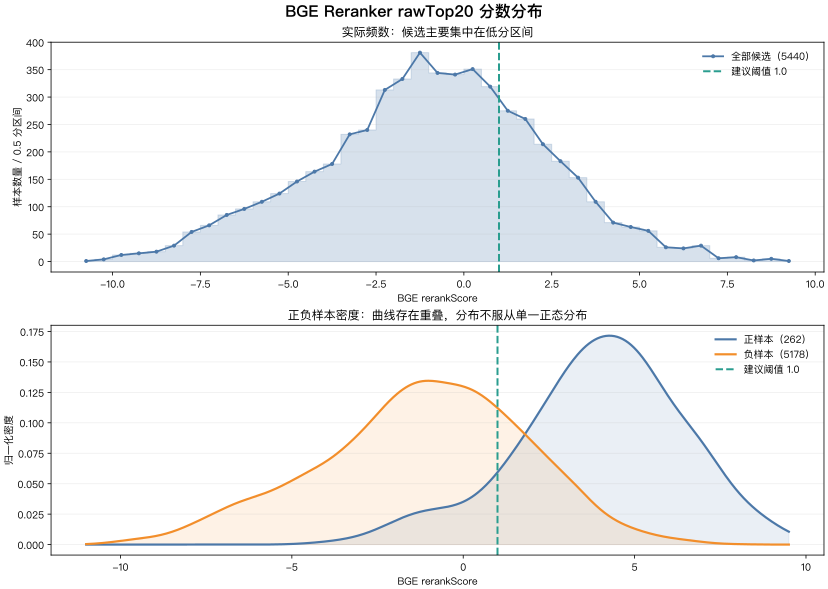

# Easy Langent RAG 分数与阈值分析

## 1. 分析范围

- 测试问题：272 条自然语言问题。
- 文档 chunk：456 个。
- 每个问题只有一个人工标注的 `relevant_chunk_id`。
- 三方案曲线使用各方案最终 Top3，共 816 个 query/chunk pair。
- BGE 阈值分析使用 reranker 缓存中的完整 rawTopK=20，共 5440 个 query/chunk pair。

这里将目标 `relevant_chunk_id` 视为正样本，其他 chunk 视为负样本。部分相邻 chunk 可能同样能回答问题，但因为没有被标注，仍会被算作负样本，因此负样本中存在少量标签噪声。

## 2. 三方案 Top3 分数分布

| 方案 | 样本 | count | p10 | p25 | p50 | p75 | p90 | mean |
| --- | --- | ---: | ---: | ---: | ---: | ---: | ---: | ---: |
| Vector | 正样本 | 212 | 0.0447 | 0.0465 | 0.0493 | 0.0519 | 0.0547 | 0.0495 |
| Vector | 负样本 | 604 | 0.0428 | 0.0446 | 0.0467 | 0.0489 | 0.0512 | 0.0469 |
| Hybrid | 正样本 | 210 | 0.1846 | 0.2030 | 0.2239 | 0.2442 | 0.2627 | 0.2231 |
| Hybrid | 负样本 | 606 | 0.1591 | 0.1790 | 0.1988 | 0.2232 | 0.2425 | 0.2001 |
| BGE | 正样本 | 226 | 2.3990 | 3.3352 | 4.6104 | 5.7191 | 6.9354 | 4.5750 |
| BGE | 负样本 | 590 | 0.3784 | 1.5710 | 2.7935 | 3.7925 | 5.0043 | 2.6921 |

使用“随机取一个正样本和一个负样本，正样本分数更高”的 AUC 衡量分数区分能力：

| 方案 | Top3 score AUC |
| --- | ---: |
| Vector | 0.6937 |
| Hybrid | 0.6989 |
| BGE Reranker | 0.7684 |

BGE 的正负分布分离最好，但仍有明显重叠。Vector 和 Hybrid 的分数范围很窄，更适合排序，不适合作为跨问题的固定相关性阈值。

## 3. BGE rawTop20 分布

| 样本 | count | min | p10 | p25 | p50 | p75 | p90 | max | mean |
| --- | ---: | ---: | ---: | ---: | ---: | ---: | ---: | ---: | ---: |
| 正样本 | 262 | -3.6825 | 0.8808 | 2.5899 | 4.0642 | 5.4743 | 6.9045 | 9.4031 | 3.9539 |
| 负样本 | 5178 | -10.6332 | -5.3615 | -3.0851 | -0.9979 | 0.9289 | 2.5643 | 7.9524 | -1.1749 |

rawTop20 上的 BGE score AUC 为 0.9097，说明 BGE 分数能够较好地区分标注正负样本：正样本 p10 约为 0.88，负样本 p75 约为 0.93，阈值候选可以从 1.0 附近开始。

### 3.1 分数与样本数量曲线



上图使用 0.5 分作为一个统计区间：上半部分展示每个分数区间内的实际候选数量，下半部分分别对正负样本归一化后绘制 KDE 密度曲线。

曲线体现出：

- 全部候选主要堆积在低分区域，符合 rawTop20 中负样本数量远多于正样本的事实。
- 负样本密度峰值位于负分区域，正样本密度峰值位于约 4 分区域，说明 BGE reranker 具有明显的相关性区分能力。
- 两条密度曲线在 0~4 分仍有重叠，因此不存在一个可以无损分离正负样本的固定阈值。
- 实际曲线存在偏斜和混合峰，不服从单一正态分布；不能使用“均值减若干标准差”推导阈值。
- `1.0` 位于正负分布的交界区域：能够过滤大部分低分负样本，同时保留大多数标注正样本。

曲线可通过以下命令从原始评测文件和 reranker cache 重新生成：

```bash
uv run --with matplotlib --with scipy scripts/rag_score_distribution.py
```

## 4. 阈值模拟

阈值应用位置：BGE rerank 完成之后、去重和 finalTopK 截断之前。低于阈值的候选不注入 Prompt，允许最终返回 0~3 条。

| 最低 BGE 分数 | Recall@3 | 至少保留一条结果的问题 | 平均注入条数 | Top3 Precision | raw 正样本保留率 | raw 负样本保留率 |
| ---: | ---: | ---: | ---: | ---: | ---: | ---: |
| 不过滤 | 80.88% | 100.00% | 3.00 | 27.70% | 100.00% | 100.00% |
| 0.0 | 78.68% | 98.53% | 2.82 | 27.86% | 92.75% | 36.93% |
| 0.5 | 78.31% | 98.16% | 2.74 | 28.59% | 90.84% | 30.24% |
| **1.0** | **78.31%** | **97.43%** | **2.63** | **29.79%** | **89.31%** | **24.16%** |
| 1.5 | 77.21% | 95.96% | 2.45 | 31.53% | 86.26% | 19.00% |
| 2.0 | 74.63% | 93.38% | 2.19 | 34.00% | 80.92% | 14.25% |

## 5. 建议策略

第一版建议设置：

```yaml
rag:
  retrieval:
    min-rerank-score: 1.0
```

选择 1.0 的原因：

- 与不设阈值相比，Recall@3 从 80.88% 降到 78.31%，损失 2.57 个百分点。
- rawTop20 中保留 89.31% 的正样本，同时过滤 75.84% 的标注负样本。
- 平均注入 chunk 从 3.00 降至 2.63，可以减少 Prompt 噪音。
- 0.5 与 1.0 的 Recall@3 相同，但 1.0 能进一步过滤负样本，因此在这套数据上 1.0 更优。
- 1.5 以上开始出现更明显的召回损失，不适合作为第一版默认值。

执行规则建议：

1. 对 rawTop20 全部执行 BGE rerank。
2. 删除 `rerankScore < 1.0` 的候选。
3. 再执行空内容、重复内容、单文档数量限制。
4. 最终截取 Top3；不足 3 条就按实际数量返回，全部低于阈值时返回“知识库没有找到足够相关内容”。

## 6. 结论边界

这套测试集的 272 个问题全部来自目标文档，没有“与知识库完全无关”的问题，因此 `1.0` 当前只能证明适合过滤候选 chunk，不能充分证明它能准确识别整条无答案查询。

正式把阈值用于 no-answer 判断前，建议补充 50~100 条域外问题，例如天气、日常闲聊、其他技术栈和与 LangChain 无关的业务问题，再统计每个问题的 Top1 BGE 分数，验证 `top1 < 1.0` 是否能稳定拒绝域外问题。
